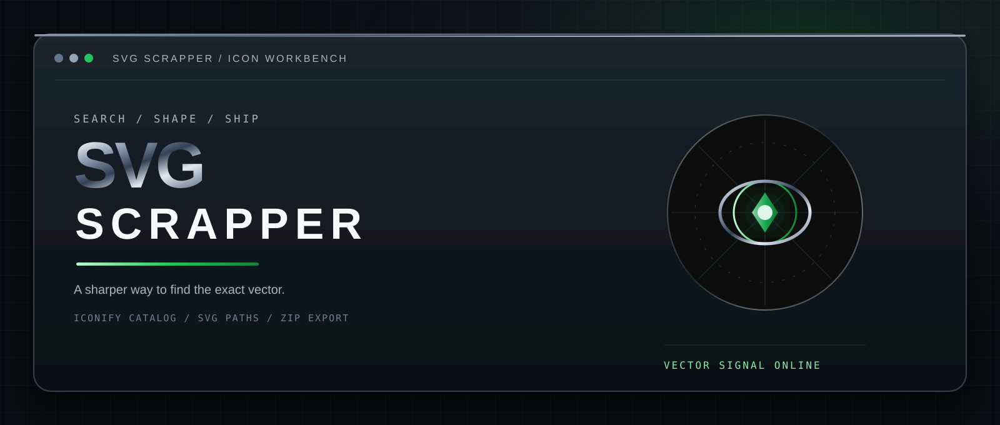

<div align="center">

  

  # SVG SCRAPPER

  ### Find the right vector. Shape it. Ship it.

  <p>
    A chrome-styled SVG icon workbench for searching, inspecting, customizing,<br>
    extracting, and batch-downloading icons from popular collections.
  </p>

  <a href="https://soheil-aghayani.github.io/svg-scrapper/">
    
  </a>
  <a href="https://github.com/Soheil-Aghayani/svg-scrapper/actions/workflows/deploy-pages.yml">
    
  </a>
  <a href="https://github.com/Soheil-Aghayani/svg-scrapper">
    
  </a>
</div>

<br>

<div align="center">

`WEB WORKBENCH`  /  `PYTHON PIPELINE`  /  `NODE UTILITY`

`JavaScript`  `Python`  `Node.js`  `Vite`  `Iconify API`

</div>

## What this is

SVG Scrapper makes the SVG asset hunt feel like a proper instrument. Search across 334k+ icons or narrow the scan to a collection, inspect the results in a live grid, tune color and size, copy the exact path data, and export the assets you need.

It is intentionally small and direct. The dashboard is framework-free, the CLIs are easy to run from a terminal, and the project keeps the useful parts of an icon workflow in one place.

```text
input      keyword, collection prefix, or source URL
signal     Iconify catalog and search API
workbench  live preview, filtering, selection, and styling
output     path data, SVG markup, individual files, ZIP, or sprite
```

## Open the site

The public dashboard is available at **[soheil-aghayani.github.io/svg-scrapper](https://soheil-aghayani.github.io/svg-scrapper/)**.

Every push to `main` runs the Vite production build and deploys the `dist/` artifact through [GitHub Pages](.github/workflows/deploy-pages.yml). The relative Vite base keeps the same build usable at localhost and under the repository site path.

## Feature surface

| Surface | Built for |
| --- | --- |
| Global search | Search the full catalog for terms like `arrow`, `cloud`, or `starfield` |
| Collection mode | Search within Lucide, Heroicons, Tabler, Material, flags, logos, emoji, and other preset packs |
| Source URLs | Paste an `allsvgicons.com/pack/...` or `allsvgicons.com/collections/...` URL to load its mapped collection |
| Live controls | Filter the loaded grid, change preview color and size, then select or clear icons |
| Copy actions | Copy a single path, complete styled SVG markup, or a JSON map of selected paths |
| Export actions | Save one SVG or download selected and filtered icons as a ZIP archive |
| Python pipeline | Download full collections concurrently and create directories, ZIPs, path JSON, or SVG sprites |
| Node utility | Download a limited collection into a directory with a companion `_paths.json` file |

## The workflow

```text
Search a word, pack, or source URL
                  |
                  v
       Query the Iconify catalog
                  |
                  v
           Fetch SVG markup
                  |
                  v
     Preview -> shape -> copy or ship
```

The browser talks directly to the public Iconify API and SVG endpoints. The Python CLI tries the allsvgicons.com SVG endpoint first and falls back to Iconify when needed.

## Run it locally

Requirements: Node.js 18+ and npm.

```bash
git clone https://github.com/Soheil-Aghayani/svg-scrapper.git
cd svg-scrapper
npm install
npm run dev
```

Open the localhost URL printed by Vite. To test the production bundle:

```bash
npm run build
npm run preview
```

The live dashboard uses the browser Clipboard API, network requests to the icon services, and JSZip from its CDN URL for ZIP creation.

## Python pipeline

```bash
# Download a complete collection into a ZIP archive
python svg_scraper.py --pack lucide --zip lucide_icons.zip

# Save a limited collection to a directory
python svg_scraper.py --pack heroicons --output ./heroicons --limit 100

# Extract path d attributes into JSON
python svg_scraper.py --pack circle-flags --export-paths flags_paths.json

# Build an SVG sprite with concurrent downloads
python svg_scraper.py --url https://allsvgicons.com/collections/flags/ \
  --limit 200 --workers 12 --export-sprite flags_sprite.svg
```

| Option | Purpose |
| --- | --- |
| `--pack`, `-p` | Collection prefix or allsvgicons.com URL |
| `--url`, `-u` | Alias for `--pack` |
| `--output`, `-o` | Directory for individual SVG files |
| `--zip`, `-z` | ZIP archive destination |
| `--export-paths` | JSON file containing extracted `path[d]` values |
| `--export-sprite` | Combined SVG sprite-sheet destination |
| `--limit`, `-l` | Maximum number of icons; `0` means all |
| `--workers`, `-w` | Concurrent download workers; default is `20` |

## Node utility

```bash
node cli.js --pack lucide --limit 30 --output ./lucide_icons
node cli.js --pack simple-icons --limit 50 --output ./brand_icons
```

The Node.js utility reads the collection catalog, downloads the requested SVG files, and writes `_paths.json` beside them.

## Project map

```text
index.html                    SEO-ready dashboard shell
style.css                     Cold-chrome interface system
app.js                        Search, preview, selection, and export logic
svg_scraper.py                Concurrent Python downloader and exporter
cli.js                        Node.js collection downloader
vite.config.js                Relative asset base for GitHub Pages
public/robots.txt             Crawler instructions and sitemap location
public/sitemap.xml            Public site URL for search engines
assets/svg-scrapper-hero.svg  README visual identity
.github/workflows/             Build and deploy pipeline
```

## Site and SEO details

The dashboard carries a descriptive title, keyword-aware description, author and application metadata, Open Graph and Twitter tags, canonical URL, theme metadata, and `SoftwareApplication` structured data. `robots.txt` and `sitemap.xml` are copied into the production build for the public site.

The visual language is deliberate: graphite surfaces, brushed-steel highlights, a restrained signal-green accent, mono labels, and small tactile states that keep the tool feeling technical without turning it into visual noise.

## Data, licensing, and responsible use

- Catalogs and search results come from the public [Iconify API](https://iconify.design/docs/api/).
- SVG downloads use [allsvgicons.com](https://allsvgicons.com/) and, in the Python pipeline, the Iconify SVG endpoint as a fallback.
- Icon collections can have different authors and licenses. Review the source collection license before redistributing downloaded assets.
- SVG Scrapper is an independent utility and is not affiliated with Iconify or allsvgicons.com.
- Be considerate of public APIs and source services. Avoid unnecessarily large or repeated downloads.

## About the builder

SVG Scrapper is built by [Soheil Aghayani](https://github.com/Soheil-Aghayani), an environmental engineer and software developer who likes turning complex information into useful tools and clear interfaces.

<div align="center">
  <br>
  <sub>Built with curiosity, clean vectors, and a little chrome.</sub>
</div>
